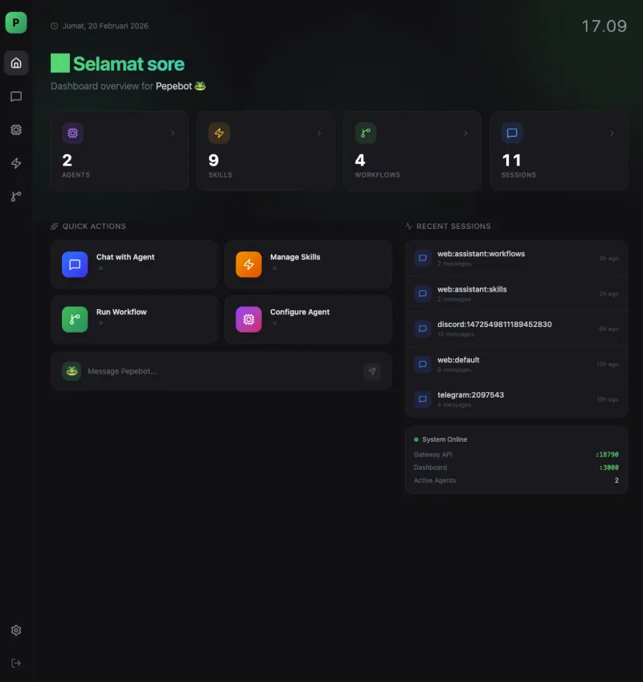
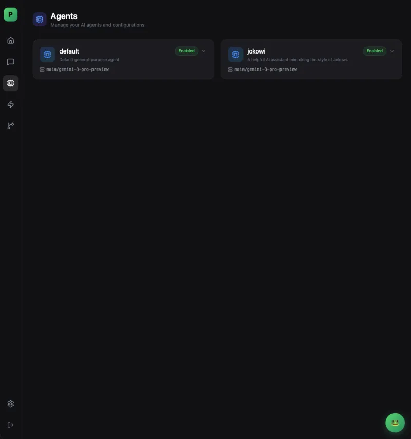
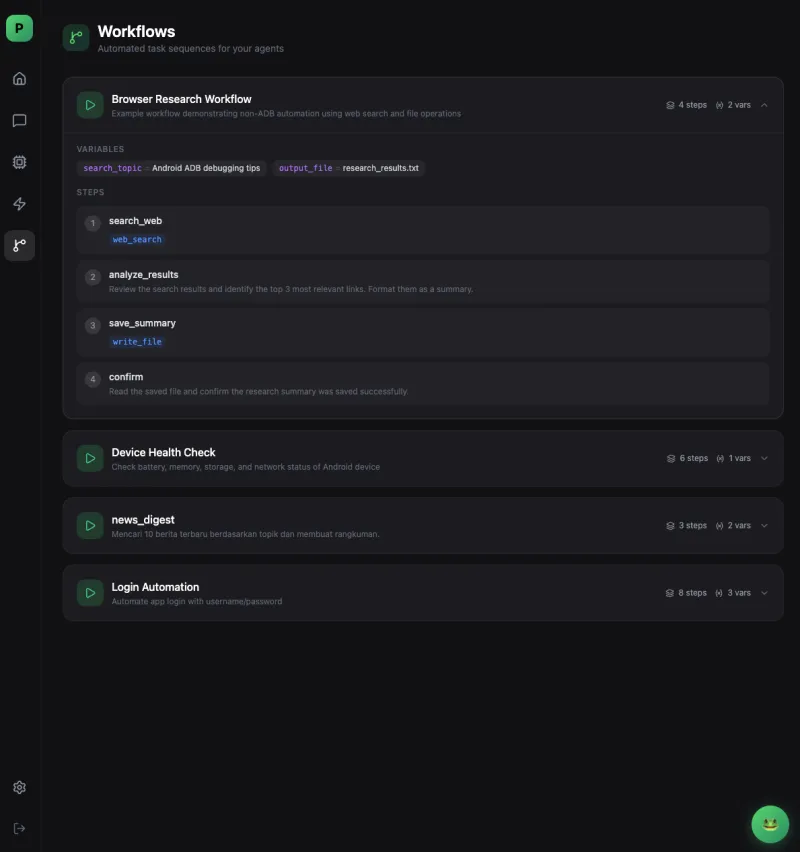

<div align="center">


<h1>🐸 Pepebot</h1>
<h3>Ultra-Lightweight Personal AI Agent</h3>

<p>


</p>

</div>

## 📋 Description

Pepebot is an ultra-lightweight and efficient personal AI agent. Pepebot is designed to provide a powerful AI assistant experience while maintaining minimal resource usage.

## ✨ Key Features

- 🤖 **Multi-Provider LLM**: Support for various AI providers including Anthropic, OpenAI, OpenRouter, Groq, Zhipu, Gemini, MAIA Router and vLLM
- 💬 **Multi-Channel**: Integration with Telegram, Discord, WhatsApp, MaixCam, and Feishu
- 🛠️ **Tools System**: Filesystem operations, shell execution, web search, and more
- 📱 **Android Automation**: ADB tools for device control and UI automation
- 🎬 **ADB Activity Recorder**: Record device interactions (taps, swipes) and auto-generate workflow files
- 🔄 **Workflow System**: Multi-step automation with variable interpolation and LLM-driven goals
- 🎯 **Skills System**: Customizable and extensible skill system
- 🚀 **Lightweight & Fast**: Small binary size with high performance
- 🔧 **Gateway Server**: HTTP server for custom integrations
- 💻 **Web Dashboard**: Modern Web UI accessible locally via gateway or online at [dash.pepebot.space](https://dash.pepebot.space)
- 🎙️ **Voice Support**: Audio/voice message transcription

## 🖥️ Web Dashboard

Pepebot comes with a fully-featured modern dashboard. You can access the unified Web UI to manage agents, skills, and chat via [https://dash.pepebot.space](https://dash.pepebot.space), or run it locally by starting `pepebot gateway`.

<div align="center">
  
  
  
  
  
</div>

## 📦 Installation

### Quick Install (Recommended)

Install the latest release with our automated installer:

```bash
curl -fsSL https://raw.githubusercontent.com/pepebot-space/pepebot/main/install.sh | bash
```

Or download and inspect first:

```bash
curl -fsSL https://raw.githubusercontent.com/pepebot-space/pepebot/main/install.sh -o install.sh
chmod +x install.sh
./install.sh
```

**What it does:**
- Detects your OS and architecture automatically
- Downloads the latest release binary
- Installs to `~/.local/bin/pepebot`
- Optionally sets up systemd (Linux) or launchd (macOS) service
- Adds pepebot to your PATH

**Supported systems:**
- Linux (x86_64, ARM64, ARMv7, ARMv6, RISC-V, MIPS variants)
- macOS (Intel, Apple Silicon)
- FreeBSD (x86_64, ARM64)

### Package Managers

#### Homebrew (macOS/Linux)

```bash
# Add tap (first time only)
brew tap pepebot-space/tap https://github.com/pepebot-space/homebrew-tap

# Install
brew install pepebot

# Start as service (optional)
brew services start pepebot
```

#### Nix (NixOS/Linux/macOS)

```bash
# Install from GitHub
nix-env -if https://github.com/pepebot-space/pepebot/archive/main.tar.gz

# Or add to your configuration.nix
environment.systemPackages = with pkgs; [
  (callPackage (fetchFromGitHub {
    owner = "pepebot-space";
    repo = "pepebot";
    rev = "v0.5.0";
    sha256 = "...";
  }) {})
];
```

#### Docker

Production-ready Docker image with **cron daemon**, **tmux**, and **systemctl replacement** for service management.

```bash
# Pull image
docker pull ghcr.io/pepebot-space/pepebot:latest

# Run interactively
docker run -it --rm \
  -v ~/.pepebot:/root/.pepebot \
  ghcr.io/pepebot-space/pepebot:latest onboard

# Run as daemon (gateway mode with cron)
docker run -d \
  --name pepebot \
  -v ~/.pepebot:/root/.pepebot \
  -p 18790:18790 \
  ghcr.io/pepebot-space/pepebot:latest gateway

# Using Docker Compose (Recommended)
curl -O https://raw.githubusercontent.com/pepebot-space/pepebot/main/docker-compose.yml
docker-compose up -d
```

**What's included:**
- ⏰ Cron daemon (auto-started with gateway)
- 🖥️ Tmux for session management
- 🔧 Systemctl replacement for service control
- 🐧 Ubuntu 24.04 LTS base

For detailed Docker/Podman deployment with cron jobs and tmux, see **[Docker Deployment Guide](./docker/README.md)**.

#### Podman (with Persistent Storage)

Same production features as Docker (cron, tmux, systemctl). Perfect for rootless containers!

```bash
# Create volume
podman volume create pepebot-data

# Run interactively
podman run -it --name pepebot \
  -v pepebot-data:/root/.pepebot \
  ghcr.io/pepebot-space/pepebot:latest onboard

# Run as background service (with cron)
podman run -d --name pepebot \
  --restart=always \
  -v pepebot-data:/root/.pepebot \
  -p 18790:18790 \
  ghcr.io/pepebot-space/pepebot:latest gateway

# Or use bind mount
mkdir -p ./pepebot-data
podman run -d --name pepebot \
  -v $(pwd)/pepebot-data:/root/.pepebot \
  -p 18790:18790 \
  ghcr.io/pepebot-space/pepebot:latest gateway
```

All configuration, sessions, skills, and workflows persist in `/root/.pepebot`. See **[Docker Deployment Guide](./docker/README.md)** for cron setup.

### Manual Installation

Download pre-built binaries from [GitHub Releases](https://github.com/pepebot-space/pepebot/releases):

```bash
# Example for Linux x86_64
wget https://github.com/pepebot-space/pepebot/releases/latest/download/pepebot-linux-amd64.tar.gz
tar xzf pepebot-linux-amd64.tar.gz
sudo mv pepebot-linux-amd64 /usr/local/bin/pepebot
```

### Build from Source

Prerequisites:
- Go 1.21 or higher
- Git

```bash
# Clone repository
git clone https://github.com/pepebot-space/pepebot.git
cd pepebot

# Build binary
make build

# Install to system (default: ~/.local/bin)
make install
```

### Build for Other Platforms

```bash
# Build for all platforms
make build-all
```

Supported platforms:
- Linux (x86_64, ARM64, RISC-V)
- macOS (x86_64, ARM64)
- Windows (x86_64)
- **Android (ARM64)** 📱 - See [Android Setup Guide](./docs/android.md) for Termux setup

### Build for Android

```bash
# Build Android binary
make build-android
```

For detailed Android setup instructions, see **[Android Setup Guide](./docs/android.md)**.

## ⚙️ Configuration

### 1. Create Configuration File

```bash
# Copy configuration template
cp config.example.json ~/.pepebot/config.json

# Edit as needed
nano ~/.pepebot/config.json
```

### 2. Configuration Structure

#### Agent Configuration

```json
{
  "agents": {
    "defaults": {
      "workspace": "~/.pepebot/workspace",
      "model": "maia/gemini-3-pro-preview",
      "max_tokens": 8192,
      "temperature": 0.7,
      "max_tool_iterations": 20
    }
  }
}
```

The default model is set to `maia/gemini-3-pro-preview` which uses MAIA Router. You can change this to any supported model from the providers below.

#### Provider Configuration

**MAIA Router (Recommended)**

[MAIA Router](https://maiarouter.ai) is a universal AI gateway that provides access to 200+ AI models (including 52+ free models) through a single OpenAI-compatible API. Perfect for Indonesian users with local payment support (QRIS).

```json
{
  "agents": {
    "defaults": {
      "model": "maia/gemini-3-pro-preview"
    }
  },
  "providers": {
    "maiarouter": {
      "api_key": "YOUR_MAIA_API_KEY",
      "api_base": "https://api.maiarouter.ai/v1"
    }
  }
}
```

To get your API key:
1. Visit [maiarouter.ai](https://maiarouter.ai) or [router.maia.id](https://router.maia.id)
2. Create an account
3. Generate your API key from the dashboard

Popular models available:
- `maia/gemini-3-pro-preview` (Recommended, free tier available)
- `maia/gemini-2.5-flash`
- `maia/claude-3-5-sonnet`
- `maia/gpt-4o`
- And 200+ more models

**Anthropic (Claude)**
```json
{
  "providers": {
    "anthropic": {
      "api_key": "sk-ant-xxx",
      "api_base": ""
    }
  }
}
```

**OpenAI**
```json
{
  "providers": {
    "openai": {
      "api_key": "sk-xxx",
      "api_base": ""
    }
  }
}
```

**OpenRouter**
```json
{
  "providers": {
    "openrouter": {
      "api_key": "sk-or-v1-xxx",
      "api_base": ""
    }
  }
}
```

**Groq**
```json
{
  "providers": {
    "groq": {
      "api_key": "gsk_xxx",
      "api_base": ""
    }
  }
}
```

**Zhipu (GLM)**
```json
{
  "providers": {
    "zhipu": {
      "api_key": "xxx",
      "api_base": ""
    }
  }
}
```

#### Channel Configuration

**Telegram Bot**
```json
{
  "channels": {
    "telegram": {
      "enabled": true,
      "token": "123456:ABC-DEF1234ghIkl-zyx57W2v1u123ew11",
      "allow_from": ["123456789"]
    }
  }
}
```

**Discord Bot**
```json
{
  "channels": {
    "discord": {
      "enabled": true,
      "token": "MTIzNDU2Nzg5MDEyMzQ1Njc4OQ.ABCDEF.xxxxxxxxxxxxxxxxxxxxxxxx",
      "allow_from": ["user_id_1", "user_id_2"]
    }
  }
}
```

**WhatsApp (via Bridge)**
```json
{
  "channels": {
    "whatsapp": {
      "enabled": true,
      "bridge_url": "ws://localhost:3001",
      "allow_from": ["628123456789@s.whatsapp.net"]
    }
  }
}
```

**MaixCam (IoT Device)**
```json
{
  "channels": {
    "maixcam": {
      "enabled": true,
      "host": "0.0.0.0",
      "port": 18790,
      "allow_from": []
    }
  }
}
```

**Feishu (Lark)**
```json
{
  "channels": {
    "feishu": {
      "enabled": true,
      "app_id": "cli_xxx",
      "app_secret": "xxx",
      "encrypt_key": "xxx",
      "verification_token": "xxx",
      "allow_from": []
    }
  }
}
```

#### Web Search Configuration

```json
{
  "tools": {
    "web": {
      "search": {
        "api_key": "YOUR_BRAVE_API_KEY",
        "max_results": 5
      }
    }
  }
}
```

#### Gateway Configuration

```json
{
  "gateway": {
    "host": "0.0.0.0",
    "port": 18790
  }
}
```

## 🚀 Usage

### CLI Mode (Interactive)

```bash
pepebot
```

Then type your commands or questions:

```
🐸 > Hello! How are you?
🐸 > Create a Python script for web scraping
🐸 > /weather Jakarta
```

### Bot Mode (Daemon)

Run with configured channels:

```bash
# Telegram bot
pepebot

# Or use systemd for auto-start
sudo systemctl enable pepebot
sudo systemctl start pepebot
```

### Environment Variables

Pepebot supports configuration via environment variables. You can use either `PEPEBOT_*` prefixed variables or native provider-specific variables.

#### Agent Configuration
```bash
export PEPEBOT_AGENTS_DEFAULTS_MODEL="claude-3-5-sonnet-20241022"
export PEPEBOT_AGENTS_DEFAULTS_MAX_TOKENS=8192
export PEPEBOT_AGENTS_DEFAULTS_TEMPERATURE=0.7
export PEPEBOT_AGENTS_DEFAULTS_WORKSPACE="~/my-workspace"
```

#### Provider API Keys (Multiple Formats Supported)
```bash
# Option 1: PEPEBOT_* prefix (recommended for Docker)
export PEPEBOT_PROVIDERS_ANTHROPIC_API_KEY="sk-ant-xxx"
export PEPEBOT_PROVIDERS_OPENAI_API_KEY="sk-xxx"
export PEPEBOT_PROVIDERS_GROQ_API_KEY="gsk_xxx"
export PEPEBOT_PROVIDERS_GEMINI_API_KEY="xxx"

# Option 2: Native provider variables (detected automatically)
export ANTHROPIC_API_KEY="sk-ant-xxx"
export OPENAI_API_KEY="sk-xxx"
export GROQ_API_KEY="gsk_xxx"
export GEMINI_API_KEY="xxx"
export GOOGLE_API_KEY="xxx"  # Alternative for Gemini
```

#### Channel Tokens
```bash
# Option 1: PEPEBOT_* prefix
export PEPEBOT_CHANNELS_TELEGRAM_ENABLED=true
export PEPEBOT_CHANNELS_TELEGRAM_TOKEN="123456:ABC-DEF..."

# Option 2: Native bot token variables
export TELEGRAM_BOT_TOKEN="123456:ABC-DEF..."
export DISCORD_BOT_TOKEN="MTk4NjIy..."
```

#### Tools Configuration
```bash
export PEPEBOT_TOOLS_WEB_SEARCH_API_KEY="your-brave-api-key"
```

#### Gateway Configuration
```bash
export PEPEBOT_GATEWAY_HOST="0.0.0.0"
export PEPEBOT_GATEWAY_PORT=18790
```

**Note:** During onboarding, Pepebot automatically detects existing environment variables and asks if you want to use them. This makes it easy to integrate with existing CI/CD pipelines or development environments.

For a complete list of all supported environment variables, see [`.env.example`](./.env.example).

## 🎯 Skills

Pepebot has an extensible skill system. Skills are prompt templates that provide special capabilities to the bot.

### Built-in Skills

1. **github** - GitHub operations and automation
2. **summarize** - Summarize text or documents
3. **tmux** - Tmux session management
4. **weather** - Weather information
5. **skill-creator** - Create new skills

### Using Skills

```bash
# In CLI
🐸 > /weather Jakarta

# Via bot (Telegram/Discord)
/weather Jakarta
```

### Creating New Skills

1. Create a new directory at `~/.pepebot/workspace/skills/my-skill/`
2. Create a `SKILL.md` file with the format:

```markdown
---
name: my-skill
description: My skill description
enabled: true
---

# My Skill Prompt

This is the prompt for my skill.

## Parameters

- param1: Description of parameter 1
- param2: Description of parameter 2
```

3. Reload or restart the bot to use the new skill

### Install Skills to Workspace

```bash
make install-skills
```

## 🔧 Development

### Project Structure

```
pepebot/
├── cmd/pepebot/          # Main application
├── pkg/
│   ├── agent/            # Agent logic & tool execution
│   ├── bus/              # Event bus for communication
│   ├── channels/         # Channel integrations
│   ├── config/           # Configuration management
│   ├── cron/             # Scheduled tasks
│   ├── heartbeat/        # Health monitoring
│   ├── logger/           # Logging system
│   ├── providers/        # LLM provider interfaces
│   ├── session/          # Session management
│   ├── skills/           # Skills loader & installer
│   ├── tools/            # Tool implementations
│   └── voice/            # Voice transcription
├── skills/               # Built-in skills
├── assets/               # Logo and assets
├── config.example.json   # Configuration template
└── Makefile             # Build automation
```

### Build Commands

```bash
# Build for current platform
make build

# Build for all platforms
make build-all

# Format code
make fmt

# Update dependencies
make deps

# Clean build artifacts
make clean

# Build and run
make run

# Show help
make help
```

### Testing

```bash
# Run tests (if available)
go test ./...

# Run with verbose output
go test -v ./...
```

## 📝 Examples

### Basic Conversation

```bash
🐸 > Explain Go channels
```

### File Operations

```bash
🐸 > Create a hello.py file with a hello world program
🐸 > Read config.json and explain its structure
```

### Web Search

```bash
🐸 > Search for the latest information about Go 1.22
```

### Shell Commands

```bash
🐸 > Run command: ls -la
🐸 > Check the status of this git repository
```

### Android Device Automation (ADB)

Pepebot includes powerful Android automation capabilities via ADB tools and workflows.

#### Prerequisites
```bash
# Install ADB (Android Platform Tools)
# macOS
brew install android-platform-tools

# Linux (Debian/Ubuntu)
sudo apt install adb

# Connect device and enable USB debugging
adb devices
```

#### Available ADB Tools
- `adb_devices` - List connected Android devices
- `adb_shell` - Execute shell commands on device
- `adb_tap` - Tap screen coordinates
- `adb_input_text` - Input text to focused field
- `adb_screenshot` - Capture device screenshots
- `adb_ui_dump` - Get UI hierarchy (XML)
- `adb_swipe` - Perform swipe gestures
- `adb_record_workflow` - Record device interactions and generate workflow files

#### Workflow System
Create multi-step automation workflows combining ADB, web, file, and shell tools.

**Available Workflow Tools:**
- `workflow_execute` - Run saved workflows
- `workflow_save` - Create new workflows
- `workflow_list` - List available workflows

## 📚 Documentation

For comprehensive guides and technical documentation, visit our [documentation hub](./docs/README.md):

- **[Installation Guide](./docs/install.md)** - Complete installation instructions for all platforms
- **[Workflow System](./docs/workflows.md)** - Multi-step automation framework documentation
- **[API Documentation](./docs/api.md)** - REST API and integration interfaces
- **[Android Setup](./docs/android.md)** - Android-specific setup and Termux instructions
- **[Build Guide](./BUILD.md)** - Build instructions and CI/CD documentation

## ⚡ 5 Test Commands (Copy & Paste Ready)

### 1️⃣ Basic Device Info
```bash
./build/pepebot agent -m "execute quick_check workflow dengan device 001a6de80412"
```
**Time:** ~5s | **Output:** Device list, Android version, screenshot

---

### 2️⃣ Health Check
```bash
./build/pepebot agent -m "jalankan device_control workflow untuk device 001a6de80412 dan berikan analisis lengkap tentang kesehatan device"
```
**Time:** ~10s | **Output:** Battery, memory, storage, network report

---

### 3️⃣ Create Custom Workflow
```bash
./build/pepebot agent -m "buatkan workflow bernama 'app_launcher' yang: 1) cek device connected, 2) launch aplikasi chrome dengan command 'am start -n com.android.chrome/com.google.android.apps.chrome.Main', 3) tunggu 2 detik, 4) ambil screenshot. Simpan dengan workflow_save"
```
**Time:** ~8s | **Output:** New workflow JSON file created

---

### 4️⃣ Batch Screenshots
```bash
./build/pepebot agent -m "buat dan eksekusi workflow yang mengambil 3 screenshot dengan nama screen_1.png, screen_2.png, screen_3.png dari device 001a6de80412"
```
**Time:** ~15s | **Output:** 3 PNG files (4 MB each)

---

### 5️⃣ Monitoring & Reporting
```bash
./build/pepebot agent -m "buat workflow 'device_monitor' yang: 1) ambil battery level, 2) ambil memory usage, 3) ambil top 5 running processes, 4) simpan semua info ke file device_report.txt, 5) ambil screenshot sebagai bukti. Lalu execute workflow tersebut untuk device 001a6de80412"
```
**Time:** ~12s | **Output:** Text report + screenshot

---

## 🔒 Security Notes

- **API Keys**: Don't commit `config.json` file to git
- **Allow List**: Use `allow_from` to restrict access
- **Permissions**: Tools have access to filesystem and shell
- **Network**: Gateway server is exposed on the network (watch your firewall)

## 🤝 Contributing

Contributions are welcome! Please:

1. Fork the repository
2. Create a feature branch (`git checkout -b feature/AmazingFeature`)
3. Commit your changes (`git commit -m 'Add some AmazingFeature'`)
4. Push to the branch (`git push origin feature/AmazingFeature`)
5. Create a Pull Request

## 📄 License

This project is licensed under the MIT License - see the [LICENSE](LICENSE) file for details.

## 🙏 Acknowledgments

- Inspired by [nanobot](https://github.com/HKUDS/nanobot) from HKUDS
- Built with ❤️ using Go

## 📞 Support

- **Issues**: [GitHub Issues](https://github.com/pepebot-space/pepebot/issues)
- **Discussions**: [GitHub Discussions](https://github.com/pepebot-space/pepebot/discussions)

---

<div align="center">
Made with 🐸 by Pepebot Contributors
</div>
